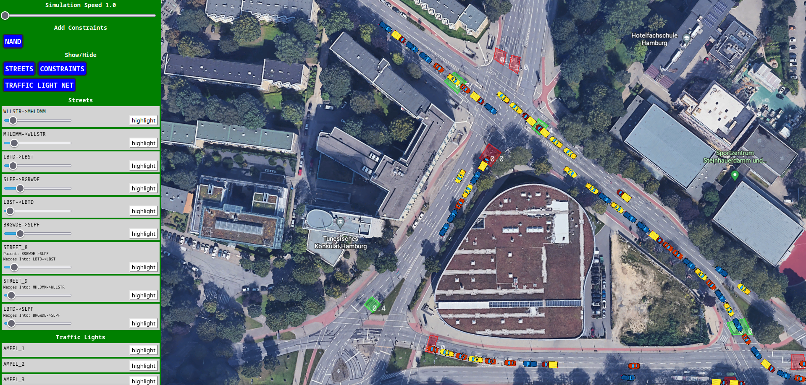

# Traffic siulator 
The traffic simulator project was a project I did for university in the course of artificial intelligence. The idea is to manage traffic lights at multiple street crossings using a constraint solver. The UI for this project is designed using React JS, along with some HTML and CSS. To run the project, simply execute npm run start.

Try out the demo **[HERE](https://jannst.github.io/traffic_simulator/)**

 

